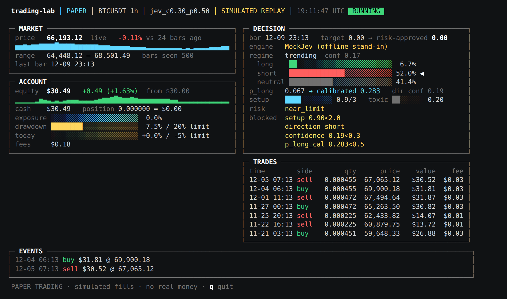

# trading-lab

A small, honest crypto research lab: download market data, backtest strategies with
real costs, then paper trade them 24/7 behind hard risk limits.

**It never places real orders and has no exchange API keys.** That is deliberate.

## What to expect

- Turning $30 into $1,000 in a day (33x) requires ~50–100x leverage on one bet. At 50x a 2% move
  against you liquidates the account. This lab does not do that and never will: exposure is capped
  at 1.0 (no leverage), long-only spot.
- Most simple strategies do **not** beat buy-and-hold after fees. The backtester exists to prove
  that before you lose money finding out.
- Any backtest result is an estimate on past data, not a promise.

## Layout

```
trading_lab/
  data.py        Binance public klines (GET /api/v3/klines, no key), CSV cache, synthetic data
  strategies.py  Strategy -> target exposure in [0, 1]. donchian, jev, trend, meanrev, buy_hold baseline
  risk.py        Deterministic risk engine: kill switch, max drawdown (latching), daily loss, no leverage
  broker.py      Paper broker: fees, slippage, min order size, rebalance band
  backtest.py    Decide on bar close, fill at next bar open (no lookahead); metrics; cost stress test
  paper.py       24/7 loop: strategy -> risk -> simulated fill, JSON state, JSONL journal
  strategies_math.py  SMA, RSI, ATR, realized vol
  jev.py         Jev (TypeSafe AI): 5 typed questions, strict parsing, fail-closed abstain, MockJev, Calibration
  brain.py       Claude Opus 5.5 escalation desk: can only no_change / pause / flatten; fails closed to pause
  learn.py       Walk-forward search, champion/challenger registry, Brier scoring
  review.py      Nightly review: Brier, gate audit, calibration refit written as pending
  cli.py         Command line
tests/           python -m unittest discover -s tests
docs/RESEARCH.md what the viral post, the prompt and the public builds actually show (with sources)
```

**Start with [docs/RESEARCH.md](docs/RESEARCH.md).** In short: the prompt in the screenshot comes from
@RohOnChain, who also promotes AgenKit. The one public build of it reports −2.10% in its backtest and has
never traded real money, and no Jev trading project has shown profit. The only small-account system found
with checkable numbers is a Japanese developer's daily Donchian breakout (≈ buy-and-hold returns with half the
drawdown, +9%/yr out-of-sample). That's the `donchian` strategy here.

Pipeline for every decision: **data → strategy (proposes) → risk engine (disposes) → broker**.
Strategies can't size orders or bypass risk; the risk engine is plain code with no overrides.

## Usage

Python 3.10+, no dependencies.

```bash
cd trading-lab

# 1. Backtest on real history (downloads from Binance's public API)
python -m trading_lab backtest --symbol BTCUSDT --interval 1h --days 365 --compare

# Offline check of the code paths (fake data, says nothing about real edge)
python -m trading_lab backtest --synthetic --compare

# 2. Paper trade with $30 of pretend money, forever (Ctrl-C to stop)
python -m trading_lab paper --strategy meanrev --capital 30
#    ...or once per hour from cron:  5 * * * *  cd /path/trading-lab && python -m trading_lab paper --once
python -m trading_lab report

# Kill switch: flatten and hold cash on the next bar
python -m trading_lab kill
python -m trading_lab unkill
# After a max-drawdown halt, read the journal, understand why, then:
python -m trading_lab reset-halt
```

## Watch it live (terminal dashboard)

```bash
python -m trading_lab live --strategy jev                  # paper trader + dashboard, real Binance data
python -m trading_lab live --strategy trend --replay       # offline demo on SIMULATED candles
python -m trading_lab paper --strategy jev &               # or run the trader separately...
python -m trading_lab watch                                # ...and attach the dashboard any time
python -m trading_lab watch --snapshot now.html            # save one frame as HTML
```



Panels: live price and sparkline, account (equity, cash, position, exposure, drawdown and daily-loss bars
against their limits, fees), the latest decision (Jev's regime, direction probabilities, calibrated p_long,
setup, toxic flow, risk state, and exactly which gate blocked the trade), recent trades, and events. The badge
turns yellow or red for stale data, a brain pause, a drawdown halt or the kill switch. `q` quits;
the trader keeps running if it was started separately.

In the US, set `TRADING_LAB_BINANCE=https://api.binance.us` (Binance.com blocks US users).

## Strategies

| Strategy | Idea | Interval |
|---|---|---|
| `donchian` | Breakout above the 20-bar high with a 50-bar trend filter; exit on the 10-bar low or an ATR trail; 1% risk per trade, max 40% exposure | `1d` |
| `jev` | Jev's five typed answers go through deterministic gates (below) | `1h` |
| `trend`, `meanrev` | Moving-average trend and RSI dip-buying, for comparison | `1h` |
| `buy_hold` | Baseline: every strategy is judged against it | any |

```bash
python -m trading_lab backtest --strategy donchian --interval 1d --days 1460
```

With $30, 1% risk per trade works out to orders of about $5, right at typical exchange minimums.

## Jev as the decision engine

Each bar, one request asks Jev five typed questions: **regime** (trending / mean_reverting / high_vol / crisis),
**direction** (long / short / neutral), **toxic_flow** (probability), **setup_quality** (0–3) and **risk_state**
(safe / near_limit / reduce). Code then decides:

- **Enter** only if setup ≥ 2, direction long with confidence ≥ 0.80, *calibrated* p_long ≥ 0.55, risk_state
  safe, regime not crisis, and toxic_flow < 0.5.
- **Exit** without needing confidence: Jev unavailable or malformed → flat; crisis → flat; reduce → halve;
  confident short call → flat.
- **Escalate** (optional, `--brain`): if confidence < 0.60 or regime is crisis, Claude Opus 5.5 reviews the bar
  and can only answer `no_change`, `pause` (no new entries for N hours) or `flatten`. Any failure means pause.

Size is volatility-scaled and the risk engine still has the final say.

```bash
export TYPESAFE_API_KEY=...        # console.typesafe.ai
python -m trading_lab jev-ping     # 1 real call: confirm the response parses
python -m trading_lab paper --strategy jev --jev live
pip install anthropic && export ANTHROPIC_API_KEY=...          # optional brain
python -m trading_lab paper --strategy jev --jev live --brain
```

Without `--jev live` a `MockJev` heuristic with the same answer format stands in, so everything runs offline.
The wire format follows TypeSafe's docs as cited by the public build it's based on, but couldn't be fetched
directly when this was written: run `jev-ping` first. Pin a version with `JEV_MODEL=...` once you tune thresholds.

## Self-learning (controlled)

```bash
python -m trading_lab learn --strategy donchian --interval 1d --days 1460 --train-days 730 --test-days 180
python -m trading_lab learn --strategy trend --days 365      # also: meanrev, jev (mock only)
python -m trading_lab backtest --strategy trend --champion   # backtest the promoted parameters
```

- `learn` does a walk-forward search: choose parameters on 90 days, score them on the *next* 30 days
  they were never tuned on, roll forward. Scoring always uses stressed costs.
- A challenger is promoted to `registry.json` only if its out-of-sample return is positive, its drawdown is
  inside the limit, it has some edge over buy-and-hold, and it beats the current champion's Sharpe.
  Every attempt, including rejections, goes to `learn_log.jsonl`.
- `paper` automatically uses the promoted parameters.
- `review --journal paper_journal.jsonl` (nightly) scores every Jev p_long against what happened (Brier vs.
  guessing the base rate), audits each gate (winners missed vs. losers avoided), and refits the calibration
  map (monotone, shrunk toward 0.5 until there are enough samples). The refit is written to
  `calibration.pending.json`; you promote it with `approve-calibration`. If Jev isn't beating the base rate on
  your journal, its confidence means nothing and it should not get money.
- Learning never changes risk limits.

## Daily loop (cron)

```cron
5 * * * *  cd ~/portfolio/trading-lab && python -m trading_lab paper --strategy jev --jev live --once
0 3 * * 0  cd ~/portfolio/trading-lab && python -m trading_lab learn --strategy donchian --interval 1d --days 1460 --train-days 730 --test-days 180
30 3 * * * cd ~/portfolio/trading-lab && python -m trading_lab review --journal paper_journal.jsonl && python -m trading_lab report
```

## About Elefin

Not supported, on purpose. As of Sept 2026 Elefin is an offshore CFD broker registered in Saint Lucia, offering
leverage up to 1:2000, and at least one broker-review site lists it as a suspicious broker, with concerns about
withdrawals. CFDs mean you never own the coin, and at 1:2000 a 0.05% move wipes out the account. Its Standard
account also needs a $50 minimum. If a strategy here ever graduates, use a large, regulated spot exchange
available in your country.

Every backtest also runs a **stress test** (2x fees, 3x slippage). If the edge disappears there, there
is no edge.

Risk defaults (flags): `--max-drawdown 0.20`, `--max-daily-loss 0.05`, `--fee 0.001`, `--slippage-bps 5`.
In backtests the drawdown halt latches for the rest of the test, just as it does live until you reset it.

## Graduation rules before any real money

1. Beats buy-and-hold on risk-adjusted terms over 1+ year of real data **and** under stressed costs.
2. Works on both BTCUSDT and ETHUSDT, and in the second half of the data, not just the first.
3. 4+ weeks of paper trading with results in line with the backtest.
4. Even then: start with money you are fully prepared to lose.

## What could be wrong

- **Overfitting:** tweaking parameters until a backtest looks good fits noise. Pick parameters, then test on data you didn't look at.
- **Fill realism:** paper fills at the bar close plus a fixed slippage. Real fills can be worse, especially in fast markets.
- **Data feed:** if Binance is unreachable or lagging, the paper trader logs `error` / `stale_data` and does not trade.
  Binance is geo-restricted in some countries; check that you're allowed to use it.
- **Regime change:** a strategy that worked in a trending year can bleed in a choppy one.
- **Correlation:** BTC and ETH move together; running the same strategy on both is not diversification.
